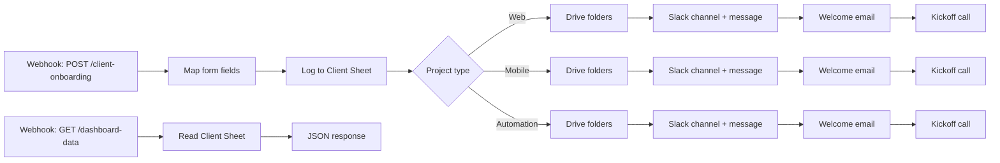

# Client Onboarding Automation

An n8n workflow that onboards a new software-house client from a single form submission. One request sets up the client's Drive workspace, Slack channel, welcome email and kickoff meeting, and logs the client for an admin dashboard.


## What it does

When a client intake form is submitted, the workflow:

- **Logs the client** in a Google Sheet with a timestamp and an "Onboarded" status.
- **Routes by project type** (Web, Mobile or Automation) so each type can follow its own path.
- **Creates a Google Drive workspace**: a folder named after the client, with `Contracts`, `Deliverables` and `Meeting Notes` subfolders.
- **Creates a Slack channel** named from the client name plus a date stamp, and posts a kickoff message with the team members and project description.
- **Sends a branded HTML welcome email** to the client through Gmail, with the project summary and next steps.
- **Books a 30-minute kickoff call** in Google Calendar for the next day and invites the client.

A second endpoint returns the full client log as JSON, which powers an admin dashboard.

## Tech stack

| Layer | Tool |
|---|---|
| Automation | n8n |
| Intake | Webhook (POST from the intake website) |
| Client log | Google Sheets |
| File workspace | Google Drive |
| Team communication | Slack |
| Client email | Gmail |
| Scheduling | Google Calendar |

## How it works



### Flow 1: Onboarding

`Webhook → Set → Google Sheets → Switch → Google Drive → Slack → Gmail → Google Calendar`

1. **Webhook** receives the form as a POST request at `/client-onboarding`.
2. **Set node** maps the request body into clean field names.
3. **Google Sheets** appends the client to the "Client Log" sheet.
4. **Switch** routes on `Project Type` into Web, Mobile or Automation.
5. **Google Drive** creates the client folder and its three subfolders.
6. **Slack** creates the project channel and posts the kickoff message.
7. **Gmail** sends the welcome email to the client.
8. **Google Calendar** creates the kickoff event for the next day, 11:00 to 11:30, with the client as an attendee.

### Flow 2: Dashboard data

`Webhook → Google Sheets → response`

A GET request to `/dashboard-data` returns every row in the client log, so a front-end dashboard can list all onboarded clients.

## Request format

The intake form sends this JSON body:

```json
{
  "clientName": "Acme Traders",
  "clientEmail": "client@example.com",
  "projectType": "Web Development",
  "teamMembers": "dev1@example.com, dev2@example.com",
  "projectDescription": "E-commerce website with admin panel",
  "whatsappNumber": "+920000000000"
}
```

`projectType` must contain `Web`, `Mobile` or `Automation`.

## Client log sheet

Create a Google Sheet with these columns:

`Timestamp` · `Client Name` · `Client Email` · `WhatsApp Number` · `Project Type` · `Team Members` · `Project Description` · `Status`

## Setup

1. **Import the workflow.** In n8n, create a new workflow, choose *Import from File* and select `workflow.json`.
2. **Add credentials** in n8n for Google Sheets, Google Drive, Slack, Gmail and Google Calendar.
3. **Create the client log sheet** with the columns above and select it in both Google Sheets nodes.
4. **Select your own calendar** in the three Google Calendar nodes.
5. **Give the Slack app** the scopes to create channels and post messages (`channels:manage`, `chat:write`).
6. **Activate the workflow** and copy the production webhook URL into your intake form.

Test it with:

```bash
curl -X POST https://YOUR_N8N_URL/webhook/client-onboarding \
  -H "Content-Type: application/json" \
  -d '{"clientName":"Test Client","clientEmail":"you@example.com","projectType":"Web Development","teamMembers":"dev@example.com","projectDescription":"Test project","whatsappNumber":"+920000000000"}'
```

## Current limitations

- The three project-type branches run the same steps for now; the routing is in place for type-specific steps later.
- The kickoff call is always booked for the next day at 11:00, without checking availability.
- Team members are listed in the Slack message but not invited to the channel automatically.
- The dashboard endpoint has no authentication, so it should not be exposed publicly with real client data.
