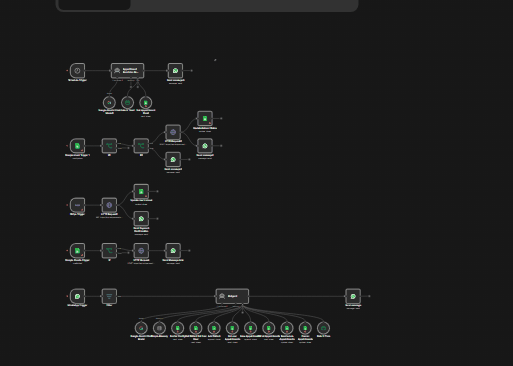
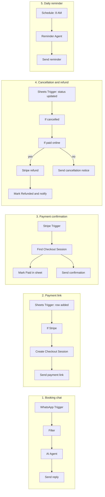

# WhatsApp Doctor Appointment Bot

An n8n workflow that lets patients book, view, reschedule and cancel clinic appointments entirely over WhatsApp. An AI agent runs the conversation, Google Sheets stores the data, and Stripe handles online payments and refunds.

## What it does

- **Books appointments in chat.** The patient picks a saved patient profile (or adds a new one), a date in the next 7 days, a free time slot and a payment method.
- **Shows only real availability.** Slots come from the clinic's working hours and slot length, minus slots already booked and any blocked time ranges.
- **Supports several patients per WhatsApp number**, so one person can book for family members.
- **Takes payment online or at the clinic.** Stripe bookings get a Checkout link on WhatsApp; cash bookings are confirmed straight away.
- **Confirms payment automatically** when Stripe reports a successful payment, and marks the appointment as paid.
- **Handles cancellations and refunds.** Cancelling a Stripe-paid appointment triggers a refund and a WhatsApp notice; cash bookings get a simple cancellation notice.
- **Sends a daily reminder** for the next day's confirmed appointments.

## Tech stack

| Layer | Tool |
|---|---|
| Automation | n8n |
| Messaging | WhatsApp Business Cloud API (Meta) |
| AI | Google Gemini 2.5 Flash, n8n AI Agent with window memory |
| Database | Google Sheets |
| Payments | Stripe Checkout, Stripe webhooks, Stripe Refunds API |

## How it works

The workflow contains five independent flows on one canvas.

### 1. Booking chat

`WhatsApp Trigger → Filter → AI Agent → Send message`

The Filter node drops WhatsApp status callbacks so only real messages reach the agent. The agent uses Gemini 2.5 Flash with a 6-message memory keyed to the sender's WhatsApp ID, and these tools:

| Tool | Purpose |
|---|---|
| Doctor Config | Reads working hours, slot duration and unavailable ranges |
| Get Patient list from User | Finds patients registered to the sender's number |
| Add Patient | Saves a new patient (name, age, gender) |
| Get all Appointments | Reads confirmed appointments to work out free slots |
| New Appointments | Saves a booking |
| Get user Appointments | Lists the sender's own bookings |
| Reschedule Appointments | Updates the date and time of a booking |
| Cancel Appointments | Sets a booking's status to Cancelled |
| Date & Time | Current date and time in Asia/Karachi |

The system prompt enforces a menu-driven flow (New Booking, My Upcoming Bookings, Reschedule, Cancel), one tool call at a time, and a confirmation step before anything is saved, changed or cancelled.

### 2. Payment link

`Google Sheets Trigger (row added) → If → HTTP Request → Send Message Link`

When a new appointment row has `payment_method` = Stripe, the workflow creates a Stripe Checkout Session with the appointment ID and WhatsApp number in the metadata, then sends the payment link to the patient.

### 3. Payment confirmation

`Stripe Trigger (payment_intent.succeeded) → HTTP Request → Update row in sheet + Send Payment Confirmation`

On a successful payment, the workflow looks up the Checkout Session, sets `payment_status` to Paid, stores the payment intent ID, and sends a confirmation on WhatsApp.

### 4. Cancellation and refund

`Google Sheets Trigger (status updated) → If cancelled → If paid online → Stripe refund → Update Refund Status + Send message`

When an appointment's status changes to Cancelled, the workflow checks for a stored payment intent. If there is one, it issues a Stripe refund, marks the row as Refunded and notifies the patient. If not, it sends a plain cancellation notice.

### 5. Daily reminder

`Schedule Trigger (8 AM) → Appointment Reminder AI Agent → Send message`

Each morning a second agent reads the Appointments sheet, finds confirmed appointments for the next day and writes the reminder message.

## Google Sheet structure

One spreadsheet with three tabs.

**Config**

| Column | Example |
|---|---|
| working_hours | 09:00 to 17:00 |
| slot_duration | 60 |
| not_available | 2026-10-10 13:00 to 15:00 |

**Patients**

`patient_id` · `whatsapp_number` · `name` · `age` · `gender`

**Appointments**

`appointment_id` · `patient_id` · `whatsapp_number` · `date` · `time` · `payment_method` · `payment_status` · `status` · `stripe_payment_intent`

## Setup

1. **Import the workflow.** In n8n, create a new workflow, open the menu and choose *Import from File*, then select `workflow.json`.
2. **Create the Google Sheet** with the three tabs above and select it in every Google Sheets node.
3. **Add credentials** in n8n:
   - WhatsApp Business Cloud API (for sending) and WhatsApp OAuth (for the trigger)
   - Google Sheets OAuth2 and Google Sheets Trigger OAuth2
   - Stripe API
   - Google Gemini
4. **Replace the placeholders:**
   - `YOUR_STRIPE_SECRET_KEY` in the three HTTP Request nodes
   - `YOUR_PHONE_NUMBER_ID` in every WhatsApp send node
   - `YOUR_GOOGLE_SHEET_ID` in every Google Sheets node
5. **Set the price and currency** in the first HTTP Request node (`unit_amount` is in the smallest currency unit, so `1000` = 10.00).
6. **Activate the workflow** and send "hi" to your WhatsApp Business number.

## Current limitations

- One clinic and one doctor schedule; no multi-doctor support yet.
- The consultation fee is a fixed amount set in the Stripe node.
- The reminder flow sends to a single configured number rather than to each patient.

## Credits

Google Sheet layout adapted from GreatStack's Doctor Appointment template.
